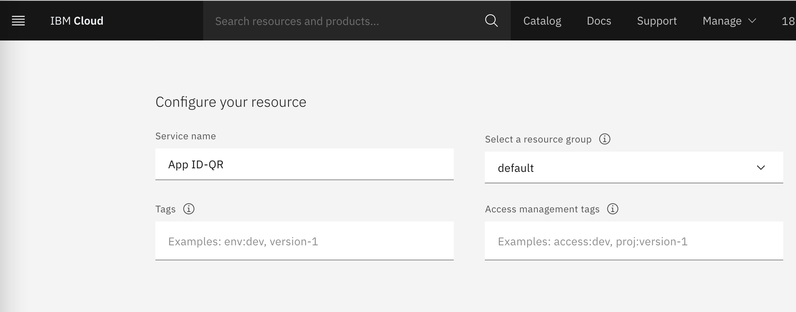
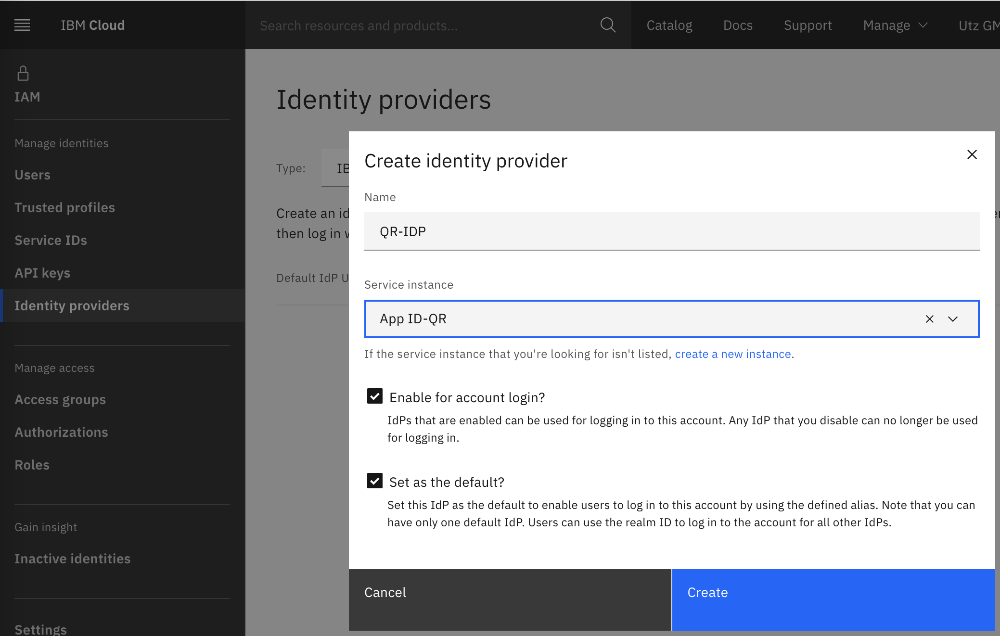

---

copyright:
  years: 2021, 2022
lastupdated: "2022-08-02"

keywords: quantum, Qiskit, runtime, near time compute, university, business, organization, appid

subcollection: quantum-computing

content-type: tutorial
completion-time: 15m
---

{{site.data.keyword.attribute-definition-list}}

# Use an ID provider (not IBM Cloud) to manage IBM Cloud users
{: #appid&cloud-org}

App ID creates an ID provider that lets you add users directly in App ID, as well as connecting to other external ID providers.  This tutorial describes how to set up your ID provider to work with IBM Cloud users, and gives instructions for users to access the environment.
{: shortdesc}

* Follow the instructions in [this topic](/docs/quantum-computing?topic=quantum-computing-cloud-provider-org) for instructions to use IBM Cloud as the ID provider for users that have IBM Cloud accounts.
* Follow the instructions in [this topic](/docs/quantum-computing?topic=quantum-computing-appid-org) for instructions to set up an ID provider other than IBM Cloud to manage users that do not have IBM Cloud accounts.

## Create an App ID instance
{: #create-appid}
{: step}

1. [Open App ID from the IBM Cloud catalog](https://cloud.ibm.com/catalog/services/app-id){: external} and log in.  Specify the following values:
   * For **Select a location**, it is best practice to keep it in the same location as the Qiskit Runtime service, which is `Washington DC (us-east)`.
   * **Select a pricing plan**:
      * The **Lite** plan is free of charge and is enough to get started. If needed, you can seamlessly upgrade to the graduated tier later.
      * The **Graduated tier** is paid per event and per user above the lite tier limits. This tier supports additional features such as multi-factor authentication. The Cloud administrator as the owning account of the App ID instance will be charged for any charges for the graduated tier instances.
  * Fill out the values for **Service name** (this will be the App ID instance name), **Resource group** (if one is being used), and any tags you want.

   {: caption="Figure 2. Create your APP ID instance" caption-side="bottom"}

2. Read and agree to the terms and click **Create**.

## Add users
{: #add-users-appid}
{: step}

We will use the **Cloud Directory** capability to add users to the ID provider.
Refer to the [App ID documentation](https://cloud.ibm.com/docs/appid){: external} for instructions how to integrate other ID providers into App ID.

1. Open the [IBM Cloud resource list](https://cloud.ibm.com/resources){: external}, expand the **Services and software** section, find your App ID instance and click its name to view its details.
2. Click **Manage Authentication** and deselect any login options that you don't need, such as Facebook and Google.
3. Navigate to **Manage Authentication** → **Cloud Directory** → **Settings** and choose whether user logins should use email or usernames.
4. Open **Manage Authentication** → **Cloud Directory** → **Password Policies** to define the password strength if desired.
5. Optionally open **Login Customization** and customize the appearance of the login page.

## Integrate the App ID instance as the ID provider for the administrator's account
{: #integrate-appid}
{: step}

1. Go to [Manage → Acces (IAM) → Identity Providers](https://cloud.ibm.com/iam/identity-providers){: external}. For **Type**, choose **IBM Cloud App ID**, then click **Create**.
2. Specify a name and select the App ID instance from the drop down list.
3. Select the checkbox to enable the ID provider.

{: caption="Figure 3. Create identity provider page" caption-side="bottom"}

4. The default IdP URL is shown.  Share this URL with users when they need to log in.

## Add Users
{: #add-user-org}
{: step}

When using App ID as ID provider with the Cloud directory, you can create users in the Cloud user interface.

1. Open the App ID instance page from the [resource list](https://cloud.ibm.com/resources){: external} Services and software section.
2. Navigate to **Manage Authentication** → **Cloud Directory** → **Users**, and click **Create User**. Enter the user details.

## Modify users' project assignments
{: #cloud-assign-user-org}
{: step}

1. Go to [Manage → Access (IAM) → Users](https://cloud.ibm.com/iam/users){: external} and click on the user.
   {: caption="Figure 11. Change User Access" caption-side="bottom"}
2. Add access groups with **Assign group** or remove the user from an access group by clicking the three dot menu and choosing **Remove user**.

## User flow
{: #user-org}

1. A user is sent the ID provider URL for the IBM Cloud account.

   The administrator can always go to [Manage → Access (IAM) → Identity providers](https://cloud.ibm.com/iam/identity-providers){: external} to look up the ID provider URL.
   {: note}
2. To work with Qiskit Runtime, users will create an API key by going to ([Manage → Access (IAM) → API keys](https://cloud.ibm.com/iam/apikeys){: external}).  They will use it for service instances they can access.
3. For further information, users can review [Getting started, Step 2](/docs/quantum-computing?topic=quantum-computing-quickstart#install-packages).

## Next steps
{: #next-steps-org}

- See [additional considerations](/docs/quantum-computing?topic=quantum-computing-quickstart-org#steps-org#considerations-org) for more information.
