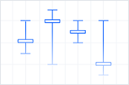

---

copyright:
  years: 2021, 2022
lastupdated: "2022-07-29"

keywords: quantum, Qiskit, runtime, near time compute, primitive programs

subcollection: quantum-computing

---

{{site.data.keyword.attribute-definition-list}}

# Qiskit Runtime overview
{: #overview}

Get a glimpse of the quantum computing future with our world-leading {{site.data.keyword.qiskit_runtime_notm}}, a new architecture that delivers significant performance enhancements to program execution. Via our physical systems and simulators (cloud-based classical emulators of quantum systems), you can experience frictionless quantum computing. That is, the ability to execute quantum programs in an environment where the classical computer is physically closer to the quantum computer. Test programs and algorithms, and develop new models with our cloud-based quantum runtime for drastically improved capacity and higher performance today.
{: shortdesc}

Because this service is in Beta phase, many functions are not yet available and are still under development, including some of the functions that are outlined in the following diagram.
{: note}

{: caption="Figure 1. Diagram of Qiskit Runtime's architecture" caption-side="bottom"}

## Why use Qiskit Runtime?
{: #why}

Run your experiments with an improved architecture:   For variational algorithms such as VQE, the loops between classical and quantum computation will happen with a low-latency connection to the quantum device.

Use primitives to get started quickly:   Primitive programs provide a simplified interface for building and customizing applications. You can submit circuits and return shot counts, pre-shot readouts, or observable expectation values. (Some primitives are future functions.)

Upload and iterate:   Upload your own Qiskit quantum program and run it with different inputs and configurations each time. (Future function)

Receive intermediate results:   Receive intermediate results as your execution runs. (Future function)

## Overview of primitive programs
{: #primitive-programs}

With Qiskit Runtime, we are introducing a new set of interfaces, in the form of primitive programs, to expand on how users run jobs on quantum computers.

The existing Qiskit interface to backends (`backend.run()`) was originally designed to accept a list of circuits and return shot counts for every job. Over time, it became clear that users have diverse purposes for quantum computing, and therefore the ways in which they define the requirements for their computing jobs are expanding. Therefore, their results also look different.

For example, a user that performs algorithm research and development cares about information beyond counts; they are more focused on efficiently calculating quasiprobabilities and expectation values of observables.

These primitives are designed to provide methods that make it easier to build modular algorithms and other higher-order programs. They provide a seamless way to use the latest optimizations in IBM Quantum hardware and software. With our first set of primitive programs, we enable capabilities that allow users to extract more performance out of the Qiskit Runtime service.

The first primitive parograms are Sampler and Estimator:

## Available primitives
{: #available-primitives}

The following primitive programs are available:

| Primitive | Description | Example output |
|---|---|---|
| Sampler | Allows a user to input a circuit and then generate quasiprobabilities. This enables users to more efficiently evaluate the possibility of multiple relevant data points in the context of destructive interference. |  |
| Estimator | Allows a user to specify a list of circuits and observables and provides the ability to selectively group between the lists to efficiently evaluate expectation values and variances for a parameter input. It is designed to enable users to efficiently calculate and interpret expectation values of quantum operators that are required for many algorithms. |  |

## How to use primitives
{: #how-to-use-primitives}

Primitive program interfaces vary based on the type of task that you want to execute on the quantum computer and the corresponding data that you want returned as a result. Once you have identified the appropriate primitive for your program, you can use Qiskit to prepare inputs, such as circuits, observables (for Estimator), and customizable options that allow you optimize your job. For full details and examples, refer to the topics about each primitive:

- [Sampler](/docs/quantum-computing?topic=quantum-computing-example-sampler)
- [Estimator](/docs/quantum-computing?topic=quantum-computing-example-estimator)

## Next steps
{: #next-steps}

- Use the [Getting started guide](/docs/quantum-computing?topic=quantum-computing-quickstart) to create an instance and run your first job.
- Use Qiskit [tutorials](https://qiskit.org/documentation/tutorials.html){: external} to learn how to create circuits with Qiskit.
- Watch the [Qiskit Runtime Tutorial video](https://www.youtube.com/watch?v=b9mdMye-iVk){: external} for more information.
- View the [Qiskit Runtime API reference](/apidocs/quantum-computing){: external} to understand how to use cURL commands to work with your cloud service instance.
- Learn about [IBM Quantum Computing](https://www.ibm.com/quantum-computing/){: external}.
