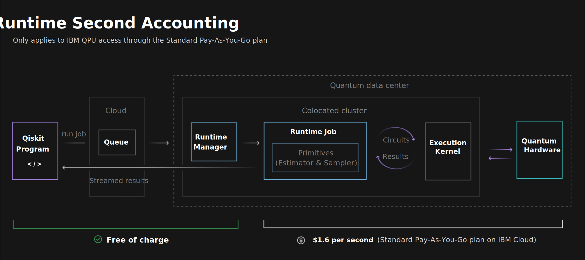

---

copyright:
  years: 2021, 2024
lastupdated: "2024-02-29"

keywords: quantum, Qiskit, runtime, near time compute, standard plan, pay-as-you-go, lite plan

subcollection: quantum-computing

---

{{site.data.keyword.attribute-definition-list}}

# Qiskit Runtime plans
{: #plans}

The Qiskit Runtime service offers these plans for running quantum programs:
- Lite Plan: Simulator access plan (free)
- Standard Plan: Quantum hardware and simulator access plan
{: shortdesc}

## Lite plans
{: #lite-plan-details}

A free plan that gives you access to quantum simulators to help you get started with Qiskit Runtime. It does not include access to IBM QPUs. The following simulators are included in this plan:

- **ibmq_qasm_simulator**: A general-purpose simulator for simulating quantum circuits both ideally and subject to noise modeling. The simulation method is automatically selected based on the input circuits and parameters.
   - **Type**: General, context-aware
   - **Simulatable Qubits**: 32
- **simulator_statevector**: Simulates a quantum circuit by computing the wave function of the qubit’s state vector as gates and instructions are applied. Supports general noise modeling.
    - **Type**: Schrödinger wave function
    - **Simulated Qubits**: 32
- **simulator_mps**: A tensor-network simulator that uses a Matrix Product State (MPS) representation for the state that is often more efficient for states with weak entanglement.
   - **Type**: Matrix Product State
   - **Simulated Qubits**: 100
- **simulator_stabilizer**: An efficient simulator of Clifford circuits. Can simulate noisy evolution if the noise operators are also Clifford gates.
   - **Type**: Clifford
   - **Simulated Qubits**: 5000
- **simulator_extended_stabilizer**: Approximates the action of a quantum circuit by using a ranked-stabilizer decomposition. The number of non-Clifford gates determines the number of stabilizer terms.
   - **Type**: Extended Clifford (for example, Clifford+T)
   - **Simulated Qubits**: 63

## Standard plan
{: #standard-plan}

A pay-as-you-go plan for accessing IBM QPUs and simulators. Build your own programs and access all the benefits of Qiskit Runtime by running on real quantum hardware.

## Pricing overview
{: #pricing-overview}

The Lite plan is free. The Standard plan charges you per *Qiskit Runtime second* when running on physical QPUs. The following diagram illustrates what is included in job execution usage. Any time spent waiting for results or in the queue for the quantum computer are excluded.

{: caption="Runtime second accounting" caption-side="bottom"}

Job execution time is the amount of time that the QPU is dedicated to processing your job.

## Next steps
{: #next-steps-plans}

- See [Manage costs](/docs/quantum-computing?topic=quantum-computing-cost) to learn how to determine and minimize your costs.
