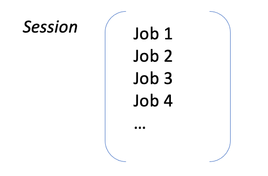
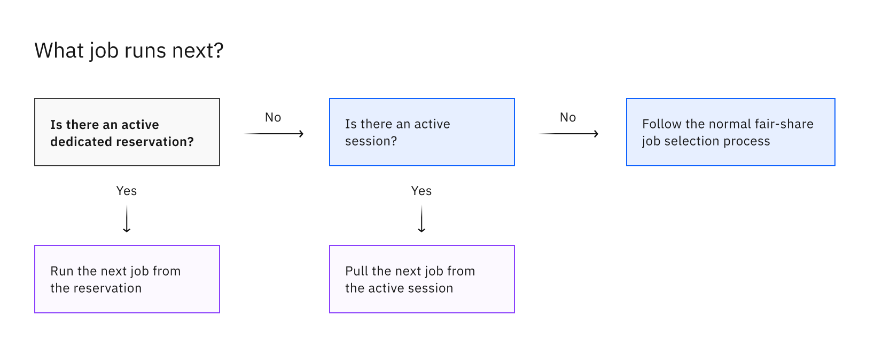

---

copyright:
  years: 2021, 2023
lastupdated: "2023-05-18"

keywords: Qiskit Runtime sessions, Qiskit Runtime reservations

subcollection: quantum-computing

---

{{site.data.keyword.attribute-definition-list}}

# Sessions
{: #sessions}

A session is a contract between the user and the Qiskit Runtime service
that ensures that a collection of jobs can be grouped and jointly
prioritized by the quantum computer's job scheduler. This eliminates
artificial delays caused by other users' jobs running on the same
quantum device during the session time.
{: shortdesc}

In simple terms, once your session is active, jobs submitted within the
session are not interrupted by other users' jobs.

{: caption="Figure 1. Diagram of how jobs flow through a session" caption-side="bottom"}

Compared with jobs that use the [fair-share
scheduler](https://quantum-computing.ibm.com/lab/docs/iql/manage/systems/queue){: external},
sessions become particularly beneficial when running programs that
require iterative calls between classical and quantum resources, where a
large number of jobs are submitted sequentially. This is the case, for
example, when training a variational algorithm such as VQE or QAOA, or
in device characterization experiments.

Runtime sessions can be used in conjunction with Qiskit Runtime
primitives. Primitive program interfaces vary based on the type of task
that you want to run on the quantum computer and the corresponding data
that you want returned as a result. After identifying the appropriate
primitive for your program, you can use Qiskit to prepare inputs, such
as circuits, observables (for Estimator), and customizable options to
optimize your job. For more information, see the
[Primitives](https://qiskit.org/documentation/partners/qiskit_ibm_runtime/primitives.html){: external} topic.

## Benefits of using sessions
{: #benefits-sessions}

There are several benefits to using sessions:

-   Jobs that belong to a single algorithm run are run together without
    interruptions, increasing efficiency if your program submits
    multiple sequential jobs.

    -   The queuing time does not decrease for the first job submitted within a session. Therefore, a session does not provide any benefits if you only need to run a single job.
    -   Since data from the first session job is cached and used by subsequent jobs, if the first job is cancelled, subsequent session jobs will all fail.
    {: note}

-   When using sessions, the uncertainty around queuing time is significantly reduced. This allows better estimation of a workload's total runtime and better resource management.
-   In a device characterization context, being able to run experiments closely together helps prevent device drifts and provide more accurate results.
-   As long as the session is active, you can submit different jobs, inspect job results, and re-submit new jobs without opening a new session.
-   You maintain the flexibility to deploy your programs either remotely (cloud / on-premise) or locally (your laptop).

## The mechanics of sessions (queuing)
{: #queuing}

For each backend, the first job in the session waits its turn in the
queue normally, but while the session is active, subsequent jobs within
the same session take priority over any other queued jobs. If no jobs
that are part of the active session are ready, the session is
deactivated (paused), and the next job from the regular fair-share queue
is run. See [Interactive timeout value](#ttl) for more information.

A quantum processor still executes one job at a time. Therefore, jobs
that belong to a session still need to wait for their turn if one is
already running.

Systems jobs such as calibration have priority over session jobs.
{: note}

## Iterations and batching
{: #iterations-and-batch}

Sessions can be used for iterative or batch execution.

### Iterative
{: #iterative}

Any session job submitted within the five-minute interactive timeout
(TTL) is processed immediately. This allows some time for variational
algorithms, such as VQE, to perform classical post-processing.

-   The quantum device is locked to the session user unless the TTL is
    reached.
-   Post-processing could be done anywhere, such as a personal computer,
    cloud service, or an HPC environment.

{: caption="Iterative session execution" caption-side="bottom"}

### Batch
{: #batch}

Ideal for running experiments closely together to avoid device drifts,
that is, to maintain device characterzation.

-   Suitable for batching many jobs together.
-   Jobs that fit within the maximum session time run back-to-back on
    hardware.

When batching, jobs are not guaranteed to run in the order they are submitted.
{: note}

{: caption="Batch session execution" caption-side="bottom"}

## How long a session stays active
{: #active}

The length of time a session is active is controlled by the *maximum
session timeout* `max_time` value and the *interactive*
timeout value (TTL). The `max_time` timer starts when the
session becomes active. That is, when the first job runs, not when it is
queued. It does not stop if a session becomes inactive. The TTL timer
starts each time a session job finishes.

## Maximum session timeout
{: #max-timeout}

When a session is started, it is assigned a *maximum session timeout*
value. You can set this value by using the `max_time` parameter, which
can be greater than the program's `max_execution_time`. For
instructions, see [Run a primitive in a session](how_to/run_session.html).

If you do not specify a timeout value, it is the smaller of these
values:

-   The system limit
-   The `max_execution_time` defined by the program

See [What is the maximum execution time for a Qiskit Runtime job?](https://qiskit.org/documentation/partners/qiskit_ibm_runtime/faqs/max_execution_time.html){: external} to determine the system limit and
the `max_execution_time` for primitive programs.

## Interactive timeout value
{: #ttl}

Every session has an *interactive timeout value* (TTL) of five minutes,
which cannot be changed. If there are no session jobs queued within the
TTL window, the session is temporarily deactivated and normal job
selection resumes. A deactivated session can be resumed if it has not
reached its maximum timeout value. The session is resumed when a
subsequent sesssion job starts. Once a session is deactivated, its next
job waits in the queue like other jobs.

After a session is deactivated, the next job in the queue is selected to
run. This newly selected job (which can belong to a different user) can
run as a singleton, but it can also start a different session. In other
words, a deactivated session does not block the creation of other
sessions. Jobs from this new session would then take priority until it
is deactivated or closed, at which point normal job selection resumes.

## What happens when a session ends 
{: #ends}

A session ends by reaching its maximum timeout value or when it is
manually closed by the user. Do not close a session until all jobs
**complete**. See [Close a session](https://qiskit.org/documentation/partners/qiskit_ibm_runtime/how_to/run_session.html#close-a-session){: external} for details. After a
session is closed, the following occurs:

-   Any queued jobs remaining in the session (whether they are queued or
    not) are put into a failed state.
-   No further jobs can be submitted to the session.
-   The session cannot be reopened.

## Sessions and reservations
{: #sessions-res}

IBM Quantum Premium users can access both reservations and sessions on
specific backends. Such users should plan ahead and decide whether to
use a session or a reservation. You *can* use a session within a
reservation. However, if you use a session within a reservation and some
session jobs don't finish during the reservation window, the remaining
pending jobs might fail. If you use session inside a reservation we
recommend that you set a realistic `max_time` value.

{: caption="Job selection" caption-side="bottom"}
 
## Next steps
{: #next-steps-sessions}

[Run a primitive in a session](https://qiskit.org/documentation/partners/qiskit_ibm_runtime/how_to/run_session.html){: external}
